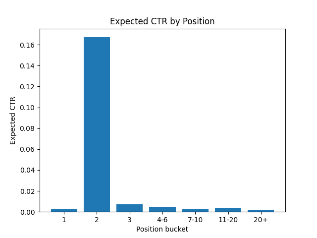
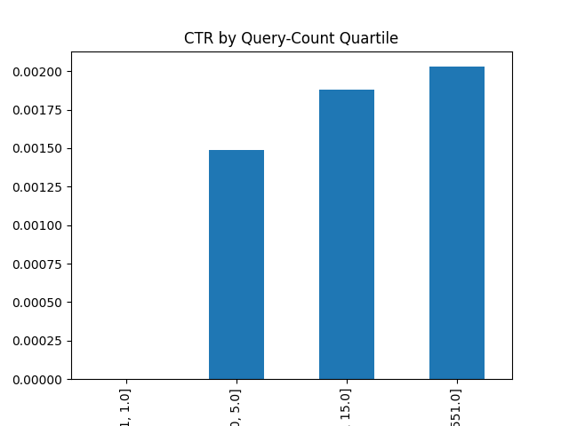

# Position Doesn't Guarantee Clicks: A Position-Adjusted CTR Opportunity Score for Content Review Prioritization

## Abstract

This project asks a simple question: which pages are ranking well in Google Search but still failing to earn their fair share of clicks? Using 90 days of search performance data across roughly 151,000 pages, I built a position-adjusted click-through-rate (CTR) baseline that flags pages underperforming relative to what is typical for their ranking position, weighted by how much traffic they receive. The resulting opportunity score surfaces a concentrated set of high-impression, well-ranked pages with large absolute click shortfalls. I then tested whether four content-level signals — optimization history, content length, content freshness, and search-query breadth — explain why these specific pages underperform, and none of them do in the expected direction. The conclusion is that the shortfall is likely driven by factors outside this dataset, such as title and snippet wording, and the practical output is a ranked review queue rather than an automated fix.

## Introduction / Problem Statement

Search visibility teams often treat "good ranking position" as a proxy for "good performance," but position and clicks are not the same thing. A page can rank on page one and still be quietly leaking traffic if searchers scroll past it without clicking. Manually auditing every page for this is impractical at scale — with over 150,000 pages in this release alone, nobody can eyeball each one. The decision this work supports is: **given a limited amount of manual review time, which pages should a content team look at first?** The output is a ranked, explainable shortlist, not a fully automated fix — the goal is to point human attention at the highest-value problems.

## Data

- **Source**: FlyRank ML Internship warehouse release, accessed via the Hugging Face `hf://` interface with DuckDB (see Acknowledgments).
- **Tables used**: `fact_daily` (daily impressions, clicks, and average position per page), `dim_content` (content metadata: word count, character count, creation/update/optimization dates, content type), `fact_query_90d` (90-day query-level signals: distinct visible query count, rare-query impression share, anonymized impression share).
- **Window**: trailing 90 days from the most recent date in `fact_daily`.
- **Filtering**: pages with fewer than 100 total impressions in the window were excluded, to avoid basing click-rate estimates on a handful of visits. This left 151,539 pages.
- **Exclusions for baseline calculation**: position buckets "1" (14 pages) and "2" (103 pages) were excluded from the expected-CTR baseline. Both buckets are small enough that a handful of unusually popular pages distort the bucket average — bucket "2," for example, is dominated by a few very high-traffic pages, producing an implausibly high expected CTR (16.7%) that does not reflect a typical position-2 page.
- **Public-safety note**: no client names, domains, URLs, raw exports, or individual search queries are included anywhere in this paper or the accompanying repository. All identifiers (`client_hash_id`, `content_hash_id`, etc.) are pseudonymized as provided by the release.

## Methodology

**Step 1 — Build a per-page performance table.** For each page, I summed impressions and clicks over the 90-day window and computed average ranking position and overall CTR.

**Step 2 — Build an expected-CTR-by-position baseline.** I grouped pages into position buckets (3, 4–6, 7–10, 11–20, 20+; buckets 1 and 2 excluded as above) and computed the impression-weighted average CTR within each bucket. This produces a simple, transparent, non-machine-learning baseline: "what CTR should a page in this position typically get?"

**Step 3 — Score every page against the baseline.** For each page, `ctr_gap = expected_ctr(position bucket) − actual_ctr`. A positive gap means the page underperforms its position. I then computed `opportunity_score = ctr_gap × total_impressions`, so that a small gap on a high-traffic page can outrank a large gap on a low-traffic page — impact, not just relative shortfall, drives the ranking.

**Step 4 — Test explanatory hypotheses.** I compared the top 500 pages by opportunity score against the full filtered population on four dimensions: whether the page had ever been optimized, word count, days since last content update, and the number of distinct search queries driving traffic to the page (as a proxy for content breadth). For the query-breadth signal, I additionally ran a correlation check across the full dataset (not just top vs. overall) after an initial top-500 comparison turned out to be confounded — see Limitations.

**Validation approach.** Because this is a diagnostic scoring method rather than a predictive model trained on held-out data, the primary validation is the internal consistency check in Step 4: testing whether the pages the method flags share a coherent, explainable characteristic, and being transparent when they do not.

## Results

- The top-ranked opportunity page received 680,046 impressions in the window with a 3.5 average position (a strong ranking position) but only a 0.13% CTR, against an expected CTR of 0.47% for that position bucket — an estimated ~2,300 "lost click" opportunity units, the largest in the dataset.
- The top 20 pages by opportunity score are overwhelmingly clustered in the 4–6 and 7–10 position buckets — i.e., pages that are *already ranking well* rather than pages struggling for visibility. This reframes the problem: for this set of pages, the bottleneck is not ranking, it's conversion of a search impression into a click.
- Hypothesis testing on the top 500 pages:

| Signal | Top 500 opportunity pages | Overall population | Direction |
|---|---|---|---|
| Never optimized | 37.6% | 71.6% | Opposite of expected |
| Median word count | 2,696 | 2,785 | No meaningful difference |
| Median days since updated | 70.5 | 99.0 | Opposite of expected |
| Median distinct queries | 214 | 7 | Confounded — see Limitations |

- A full-dataset correlation between distinct query count and CTR gap was 0.05 (effectively no relationship), and median CTR rose slightly across query-count quartiles (0.000% → 0.15% → 0.19% → 0.20%) rather than falling — the opposite of what the top-500 comparison alone suggested.

The chart above also visually confirms the Limitations note below: the position-2 bucket's expected CTR is an outlier driven by a handful of high-traffic pages in a very small bucket (103 pages), not a reliable "typical" value — which is exactly why buckets 1 and 2 are excluded from opportunity scoring.

The chart above shows CTR rising (not falling) as query count increases across the full dataset — the opposite of what the top-500 comparison alone suggested, confirming the confound described in Limitations.

## Limitations & Honest Framing

- **This is an observational, descriptive analysis, not a causal study.** Nothing here demonstrates that changing any specific page will change its click rate — the findings are decision-support signals, not proof of cause and effect.
- **The query-breadth finding is a documented false lead, kept in the paper deliberately.** An initial top-500-vs-overall comparison suggested broad, many-query pages were overrepresented among underperformers. A full-dataset correlation check revealed this was confounded: `opportunity_score` is partly driven by impression volume, and high-impression pages tend to also be high-query-count pages, independent of any real CTR relationship. This is included as a methodological caution — surface-level top-vs-bottom comparisons can produce misleading patterns when the ranking metric and the candidate explanation share a common driver.
- **None of the four tested content-level signals explain the underperformance in the expected direction.** This is a genuine negative result, not a gap in the analysis. The most likely explanation for the CTR shortfall — search-result title and snippet wording, brand recognition, or competing results on the page — is not captured anywhere in this dataset release.
- **Position-1 and position-2 buckets are unreliable** due to very small sample sizes (14 and 103 pages respectively) and are excluded from scoring.
- **No individual query terms, client identities, or raw records appear in this paper**, consistent with the public-data rule for this release.

## Ranked Recommendations

Rather than an automated content fix, the practical output of this work is a prioritized manual-review queue. Because none of the tested content-level signals explain the shortfall (see Limitations), the same recommendation applies to nearly every page on this list: **the page ranks well and receives substantial impressions, but converts far fewer of them into clicks than expected for its position — with no clear content-level cause in this dataset. Recommended action: manual review of the search-result title and meta description.**

Pages are prioritized by opportunity score (CTR gap × impressions), so fixing the top of this list yields the largest absolute click gain per page reviewed. The top 30 pages by opportunity score:

| Rank | Page ID | Avg. Position | Actual CTR | Opportunity Score |
|---|---|---|---|---|
| 1 | content_943dc881428182b8 | 3.5 | 0.13% | 2,307 |
| 2 | content_acbcc847f8996314 | 4.3 | 0.13% | 2,103 |
| 3 | content_62770e1299963fe4 | 5.1 | 0.11% | 1,899 |
| 4 | content_21309e9a83c83653 | 5.0 | 0.17% | 1,789 |
| 5 | content_f352b7cfd0b2f434 | 4.0 | 0.13% | 1,782 |
| 6 | content_77276ad7a26f4905 | 5.8 | 0.15% | 1,598 |
| 7 | content_33d31496fca9665e | 6.2 | 0.02% | 1,565 |
| 8 | content_599eba17030c875c | 5.9 | 0.10% | 1,512 |
| 9 | content_39e19a3ec2d95f9d | 18.2 | 0.002% | 1,260 |
| 10 | content_9648c4d1595a0794 | 3.7 | 0.03% | 1,214 |
| 11 | content_32c5cc913fb4ff41 | 5.8 | 0.15% | 1,193 |
| 12 | content_93aadc6eeccba7b8 | 5.1 | 0.13% | 1,180 |
| 13 | content_f107e54b10b43725 | 4.8 | 0.27% | 1,165 |
| 14 | content_f2388a4b87a3b1dc | 5.7 | 0.11% | 1,155 |
| 15 | content_c1f764a2f362d1c3 | 7.1 | 0.02% | 1,138 |
| 16 | content_6302b8bce0bb84cb | 3.7 | 0.15% | 1,131 |
| 17 | content_471d9cabce329a66 | 5.9 | 0.25% | 1,130 |
| 18 | content_11bf4c33adea7bdc | 14.8 | 0.001% | 1,111 |
| 19 | content_f43118e089ecc69a | 6.7 | 0.09% | 1,080 |
| 20 | content_6eda21f7025fe783 | 5.1 | 0.13% | 1,056 |
| 21 | content_ac7b77e81c53d636 | 5.9 | 0.14% | 1,051 |
| 22 | content_b902320872acab45 | 5.8 | 0.14% | 1,025 |
| 23 | content_e241d6415ac9e534 | 4.7 | 0.21% | 1,017 |
| 24 | content_9540d884af3e41fd | 9.2 | 0.03% | 978 |
| 25 | content_684037d084cbe6cc | 4.8 | 0.11% | 975 |
| 26 | content_99fc6465edb0e52c | 17.1 | 0.0004% | 931 |
| 27 | content_15168cd1c94e3529 | 4.1 | 0.22% | 881 |
| 28 | content_012de75c008aa653 | 16.1 | 0.0004% | 852 |
| 29 | content_a503431efe530d6a | 5.4 | 0.19% | 833 |
| 30 | content_fd2117c2c6790e4b | 5.6 | 0.20% | 833 |

A secondary pattern worth flagging within this list: rows 9, 18, 26, and 28 sit far outside the position-4-to-10 range that dominates the rest of the table (positions 14–18), yet still make the top 30 because a large impression volume amplifies even a small CTR gap. These four are lower-priority than their raw rank suggests, since a page ranking at position 15+ is inherently less likely to be clicked regardless of any fixable issue — they are included here for completeness but should be reviewed after the position-4-to-10 pages above them.

Full impressions, clicks, and content metadata for each of the 30 pages above were pulled directly from the warehouse release using the notebooks in `work/` and are not separately republished as a raw export, consistent with this project's public-data rule.

## Reproducibility

All notebooks used to produce this analysis are available in the `work/` folder of the accompanying repository, including the data-access notebook, the opportunity-scoring notebook, and the hypothesis-testing notebook. The repository's `submission/paper_url.txt` file links back to this deployed page.

## Acknowledgments & Data Credit

Built on the FlyRank ML Internship dataset. [https://flyrank.ai](https://flyrank.ai)
